# 前置知识

## 副作用函数

副作用函数指的是会产生副作用的函数，如下面的代码

```ts
function effect() {
  document.body.innerText = 'hello vue3'
}
```

effect函数的执行会直接或者间接影响其他函数的执行，这时我们说effect函数产生了副作用。

副作用很容易产生，例如一个函数修改了全局变量

```ts
// 全局变量
let val = 1
function effect() {
  val = 2 // 修改全局变量，产生副作用
}

``` 

## 响应式数据

理解了什么是副作用函数，再来说说什么是响应式数据

```ts
const obj = { text: 'hello world' }
function effect() {
  document.body.innerText = obj.text
}
```

如上面的代码，副作用函数effect会设置body元素的innerText属性。当**obj.text**的值发生改变时，我们希望effect会重新执行

如果我们能做到这一点，那么对象obj就是响应式数据

# 基本实现

接着上文思考，如何才能让obj变成响应式数据呢？

1. 当effect执行时，会触发字段**obj.text**的读取操作
2. 当修改obj.text的值时，会触发字段**obj.text**的设置操作

如果我们能拦截到一个对象的读取和设置操作，那么事情就变得简单了，当读取字段obj.text时，我们可以把副作用函数effect存到一个桶里


接着，当设置obj.text时，再把副作用函数effect从"桶里"拿出来并执行即可

现在我们的问题变成了如何拦截对象属性的读取和设置操作，有两种方式

1. Object.defineProperty：(Vue2采用的方式)
2. Proxy：(Vue3采用的方式)

``` ts
// 存储副作用函数的桶
const bucket = new Set()

// 原始数据
const data = { text: 'hello world' }
// 对原始数据的代理
const obj = new Proxy(data, {
  // 拦截读取操作
  get(target, key) {
    bucket.add(effect)

    return target[key]
  },

  // 拦截设置操作
  set(target, key, value) {
    target[key] = value
    
    // 取出effect执行
    bucket.forEach(fn => fn())
    
    return true
  }
})
```

> 提问：上面的这段代码有什么缺陷？

**我们直接通过名字effect来获取副作用函数，要是换了个名字怎么办**

因此我们要想办法去掉这种硬编码的机制

# 完善的响应式系统

先来解决上面遗留下来的问题

```ts
// 用一个全局变量存储被注册的副作用函数
let activeEffect

// 用于注册副作用函数
function effect(fn) {
  // 当调用的时候赋值给activeEffect
  activeEffect = fn

  fn()
}


// 存储副作用函数的桶
const bucket = new Set()

// 原始数据
const data = { text: 'hello world' }
// 对原始数据的代理
const obj = new Proxy(data, {
  // 拦截读取操作
  get(target, key) {
    if (activeEffect) // 新增
      bucket.add(activeEffect) // 新增

    return target[key]
  },

  // 拦截设置操作
  set(target, key, value) {
    target[key] = value

    // 取出effect执行
    bucket.forEach(fn => fn())
    
    return true
  }
})

effect(
  () => {
    console.log('effect run')
    document.body.innerText = obj.text
  }
)
```

可以看到，匿名副作用函数内部读取了字段obj.text的值，于是乎与副作用函数会建立起响应联系。

接着，我们开启了一个定时器，为对象添加了一个**新属性**,我们知道，在匿名副作用函数内并没有读取obj.notExist属性的值，所以理论上，字段obj.notExist并没有与副作用建议响应联系，因此，定时器内语句的执行不应该触发匿名函数的重新执行。

提问：导致该问题的根本原因是什么？

我们来解决这个问题，需要重新设计"桶的数据结构"

在上一节中，我们使用了Set(集合)数据结构来当副作用函数的"桶"。例如当读取属性时，无论是哪一个属性，都会收集到桶里；当设置属性时，无论是哪一个属性，也都会从“桶”里把副作用函数拿出来执行。

**导致该问题的根本原因是，我们没有在副作用函数与被操作的目标字段之间建立明确的联系**。

那应该怎么设计呢？在回答这个问题前，我们需要先仔细观察下面的代码：

```ts
effect(function effectFn() {
  document.body.innerText = obj.text
})
```

这段代码存在三个角色：

1. 被(读取)的代理对象obj
2. 被(读取)的字段名text
3. 使用effect函数注册的副作用函数effectFn

如果用target来表示一个代理对象所代理的原始对象，用key来表示被操作的字段名，用effectFn来表示被注册的副作用函数，那么可以把这三种建立如下关系：

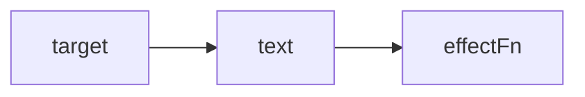
这是一种树形结构，下面继续举几个例子进行补充说明

如果有两个副作用函数同事读取同一个对象的属性值

```ts
effect(function effectFn1() {
  obj.text
})
effect(function effectFn2() {
  obj.text
})
```
那么关系如下
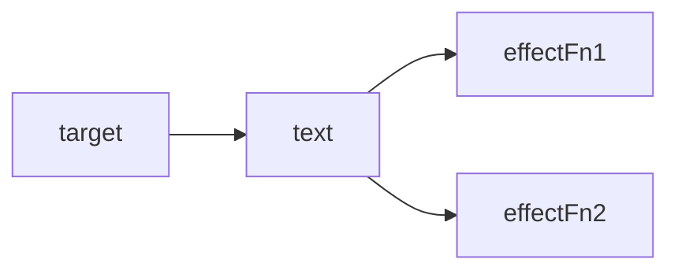

如果一个副作用函数读取了同一个对象的两个不同属性

```ts
effect(function effectFn() {
  obj.text1
  obj.text2
})

```

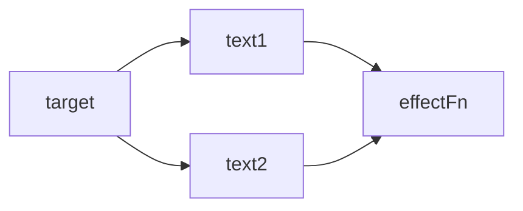

如果在不同的副作用函数读取了两个对象的不同属性：


```ts
effect(function effectFn1() {
  obj1.text1
})
effect(function effectFn2() {
  obj2.text2
})
```

那么关系如下：

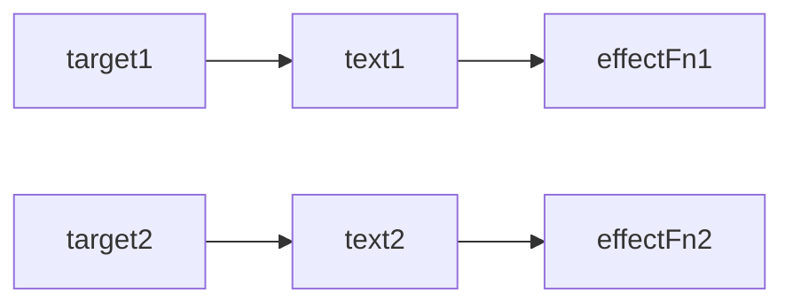

接着，我们尝试用代码来实现这个新的"桶"。首先，我们需要用**WeakMap**代替Set作用桶的数据结构:

```ts
const bucket = new WeakMap()

const obj = new Proxy(data, {
  get(target, key) {
    if (!activeEffect) return

    // 根据target从"桶"中取得depsMap, 它也是一个Map类型：key --> effect
    let depsMap = bucket.get(target)
    // 如果不存在depsMap，那么新建一个Map并与其关联
    if (!depsMap) bucket.set(target, depsMap = new Map())

    // 在根据key从depsMap中取得deps，它是一个Set类型
    // 里面存储着所有与当前key相关联的副作用函数，effects
    let deps = depsMap.get(key)
    if (!deps) depsMap.set(key, deps = new Set())
    
    // 最后将当前激活的副作用函数添加到"桶里"
    deps.add(activeEffect)

    return target[key]
  },
  set(target, key, newValue) {
    target[key] = newValue

    // 根据target从桶中取得depsMap,它是key --> effect
    const depsMap = bucket.get(target)
    if (!depsMap) return
    // 根据key取得所有副作用函数 effects
    const effects = depsMap.get(key)

    // 执行副作用函数
    effects && effects.forEach(fn => fn())
  }
})
```


从这段代码可以看出构建数据结构的方式，我们分别使用了WeakMap、Map和Set

1. WeakMap由target --> Map 构成
2. Map 由 key --> Set 构成

来看一下关系图：

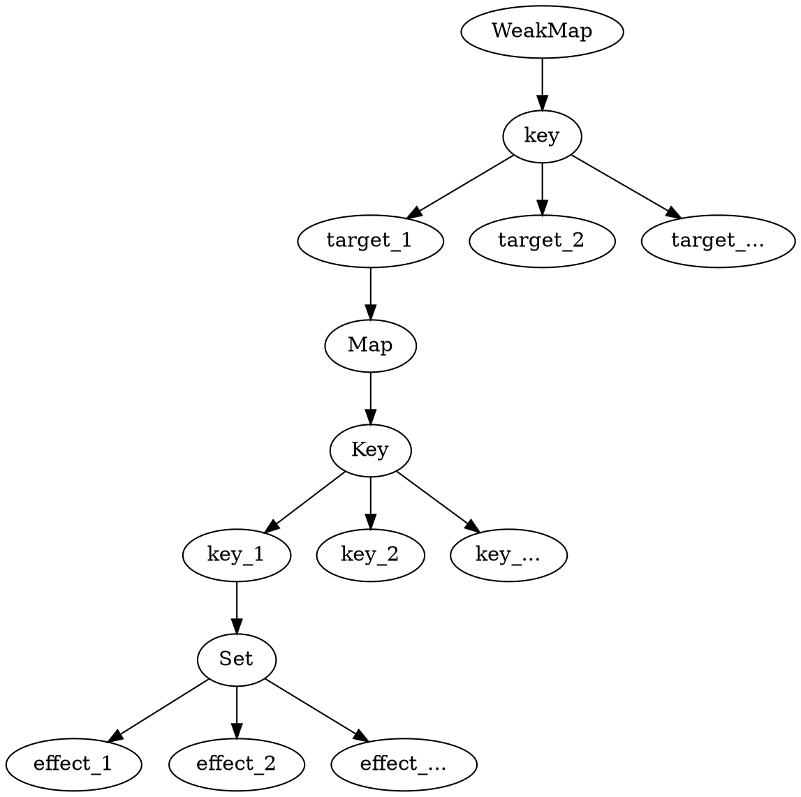

### WeakMap和Map的区别

WeakMap和Map的区别在于，WeakMap的key只能是对象，而Map的key可以是任意类型。这是因为WeakMap的key是弱引用，当key没有被其他变量引用时，会被垃圾回收机制回收。而Map的key是强引用，不会被回收。

来看一段例子

```js
const map = new Map();
const weakmap = new WeakMap();

(function(){
    const foo = {foo: 1};
    const bar = {bar: 2};
    map.set(foo, 1);
    weakmap.set(bar, 2);
})()
```

在这段代码中，foo和bar都是局部变量，当函数执行完毕后，它们会被回收。但是，map中的foo会被保留，因为map中的key是强引用，而weakmap中的bar会被回收，因为weakmap中的key是弱引用。


## 代码优化

在目前的实现中，当读取到属性值时，我们直接在get拦截函数里编写把副作用函数收集到"桶"里的这部分逻辑，但更好的做法是将这部分逻辑单独封装到一个track函数中。同样，我们也可以把出发副作用函数重新执行的逻辑封装到trigger函数中：

```ts

function track(target, key) {
  if (!activeEffect) return
  let depsMap = bucket.get(target)
  if (!depsMap) bucket.set(target, depsMap = new Map())

  let deps = depsMap.get(key)
  if (!deps) depsMap.set(key, deps = new Set())
  deps.add(activeEffect)
}

function trigger(target, key) {
  const depsMap = bucket.get(target)
  if (!depsMap) return
  const effects = depsMap.get(key)

  effects && effects.forEach(fn => fn())
}

function reactive(target) {
  return new Proxy(target, {
    get(target, key){
      track(target, key)
      return target[key]
    },
    set(target, key, newVal) {
      target[key] = newVal
      trigger(target, key)
    }
  })
}
```

## 分支切换

首先，我们需要明确分支切换的定义，如下面的代码所示：

```js
onst data = reactive({ text1: 'hello text1', text2: 'hello text2', ok: true })
effect(() => {
  window.text1.innerText = data.ok ? data.text1 : 'not'
})
```

在effect函数内部存在一个三元表达式，根据字段ok的值会执行不同的代码分支。当字段ok的值发生变化时，代码执行的分支会跟着变化，这就是所谓的分支切换。

分支切换可能会产生遗留的副作用函数。拿上面这段代码来说，ok的初始值为true，这时会读取obj.text的值，所以当effectFn函数执行时会触发字段data.ok和字段data.text这两个属性的读取操作，此时联系如下

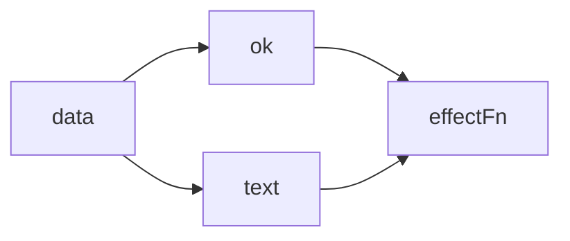

可以看到，副作用函数effectFn分别被字段data.ok和字段data.text所对应的依赖集合收集。理想情况下副作用函数effectFn不应该被字段obj.text所对应的依赖集合收集，如图所示

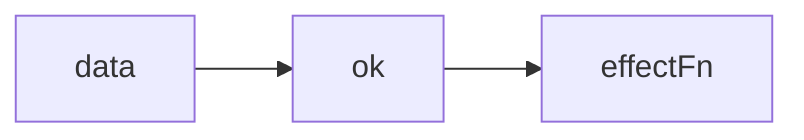

但按照前文的实现，我们还做不到这一点。也就是说，当我们把字段data.ok的值修改为false，并触发副作用函数重新执行之后，整个依赖关系仍如上上图一样，这时就产生了遗留的副作用函数。

遗留的副作用函数会导致不必要的更新。当我们的ok为false之后，修改text1的值，都会执行effectFn函数，这是没必要的，因为结果始终是**not**。


解决这个问题的思路很简单，每次副作用函数执行时，我们可以先把它从所有与之关联的依赖集合中删除，如下图所示

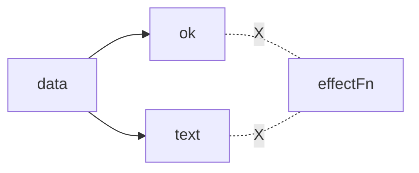

当副作用函数执行完毕后，会重新建立起联系，但在新的联系中不会包含遗留的副作用函数。所以，如果我们能做到每次副作用函数执行前，将其从相关联的依赖集合中移除，那么问题就迎刃而解了。

要将一个副作用函数从所有与之关联的依赖中移除，就需要明确知道哪些依赖集合中包含它，因此我们需要重新设计副作用函数，如下面的代码所示。我们添加一个deps属性，该属性是一个数组，用来存储所有包含当前副作用函数的依赖集合：

```js
let activeEffect;

function effect(fn) {
  const effectFn = () => {
    activeEffect = effectFn
    fn()
    activeEffect = null
  }
  effectFn.deps = []

  effectFn()
}
```

那么effectFn.deps数组中的依赖是如何收集的呢？其实是在track函数中：

```js
function track(target, key) {
  // ...
  deps.add(activeEffect)

  // deps就是一个与当前副作用函数存在联系的依赖集合
  activeEffect.deps.push(deps)
  
}
```

如以上代码所示，在track函数中我们将当前执行的副作用函数activeEffect添加到依赖集合deps中，这说明deps就是一个与当前副作用函数存在联系的依赖集合，于是我们也把它添加到deps数组中，这样就完成了对依赖集合的收集。

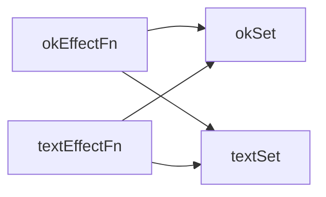

有了这个联系后，我们就可以在每次副作用函数执行时，根据effectFn.deps获取所有相关联的依赖集合，近而将副作用函数从依赖集合中移除：

```js
let activeEffect;

function effect(fn) {
  const effectFn = () => {
    cleanup(effectFn)
    activeEffect = effectFn
    fn()
    activeEffect = null
  }

  effectFn()
}
```
下面是cleanup函数的实现
```js
function cleanup(effectFn) {
  for (let i = 0; i < effectFn.deps.length; i++) {
    const deps = effectFn.deps[i]
    // 将effectFn从依赖集合中移除
    deps.delete(effectFn)
  }
  // 最后需要充值effectFn.deps数组
  effectFn.deps.length = 0
}
```

cleanup函数接收副作用函数作为参数，遍历副作用函数的effectFn.deps数组，该数组的每一项都是一个依赖集合，然后将该副作用函数从依赖集合中移除，最后清空deps数组。

至此，我们的响应系统已经可以避免副作用函数产生遗留了。但如果你尝试运行代码，会发现目前的实现会导致无限循环，问题出现在trigger函数中：

```js
effects && effects.forEach(fn => fn()) //问题出在这句代码
```

我们遍历effects集合，它是一个Set集合，里面存储着副作用函数。当副作用函数执行时，会调用cleanup进行清除，实际上就是从effects集合中将当前执行的副作用函数剔除，但是副作用函数的执行会导致其重新被收集到集合中，而此时effects集合的遍历仍在进行。这个行为可以用如下简短的代码来表达：

```js
const set = new Set([1])

set.forEach(item => {
  set.delete(1)
  set.add(1)
  console.log('遍历中')
})

```

语言规范中对此有明确的说明，在调用forEach遍历Set集合时，如果一个值已经被访问过了，但该值被删除并重新添加到集合，如果此时forEach的遍历没有结束，那么该值会重新被访问。因此，上面的代码会无限执行。解决方法很简单：

```js
const set = new Set([1])
const newSet = new Set(set)
newSet.forEach(item => {
  set.delete(1)
  set.add(1)
  console.log('遍历中')
})
```

回到trigger函数，我们需要同样的手段来避免无限执行：

```js
function trigger(target, key) {
  const depsMap = bucket.get(target)
  if (!depsMap) return
  const effects = depsMap.get(key)
  if (!effects) return
  const effectsToRUn = new Set(effects)

  effectsToRUn.forEach(fn => fn())
  // effects && effects.forEach(effectFn => effectFn()) // 删除
}

```


## 嵌套的effect与effect栈


effect是可以发生嵌套的，例如

```js
effect(() => {
  effect(() => {})
})
```

什么场景下会出现嵌套的effect呢？拿Vuejs来说，实际上Vue.js的渲染函数就是在一个effect中执行的：

```js


// Bar组件
const Bar = {
  render() {}
}

// Foo组件渲染了Bar组件
const Foo = {
  render() {
    return <Bar /> //jsx
  }
}
```

相当于

```js
effect(() => {
  Foo.render()
  effect(() => {
    Bar.render()
  })
})
```
这个例子说明了为什么effect要设计成可嵌套的，我们当前的响应系统并不支持嵌套

```js
effect(() => {
  console.log('effect1 执行')
  effect(() => {
    console.log('effect2 执行')
    window.text2.innerText = data.text2
  })

  window.text1.innerText = data.text1
})
```

在这种情况下，我们希望当修改text1时回处罚effectFn1执行。由于effectFn2嵌套在effectFn1里，所以会间接触发。但结果并不是这样

当我们修改text1，发现fn1并没有执行，反而使得effectFn2重新执行了。

问题出在下面这段代码

```js

function effect(fn) {
  const effectFn = () => {
    cleanup(effectFn)
    activeEffect = effectFn
    fn()
  }
  effectFn.deps = []

  effectFn()

```

我们用全局变量activeEffect来存储通过effect函数注册的副作用函数，这意味着同一时刻activeEffect所存储的副作用函数只能有一个。当副作用函数发生嵌套时，内层会覆盖外层的。

为了解决这个问题，我们需要一个副作用函数栈effectStack，在副作用函数执行时，将当前副作用函数压入栈中，待副作用函数执行完毕后将其从栈中弹出，并始终让activeEffect指向栈顶的副作用函数。

```js

const effectStack = [] // 新增

function effect(fn) {
  const effectFn = () => {
    cleanup(effectFn)
    // 当调用effect注册的副作用函数时，将副作用函数赋值给activeEffect
    activeEffect = effectFn
    // 在调用副作用函数之前将当前副作用函数压入栈中
    effectStack.push(effectFn)
    fn()
    // 在当前副作用函数执行完毕后，将当前副作用函数弹出栈，并把activeEffect还原为之前的值
    effectStack.pop()
    activeEffect = effectStack[effectStack.length - 1]
  }
  effectFn.deps = []

  effectFn()
}

```

这样当副作用函数发生嵌套时，栈底存储的就是外层副作用函数，而栈顶存储的是内容副作用函数

## 避免无限递归循环

举个例子

```js
const data = reactive({ foo: 1 })
effect(() => data.text1++)
```

可以看到，在effect注册的副作用函数内有一个自增操作obj.foo++,该操作会引起栈溢出


在这个语句中，即会读取obj.foo的值，又会设置obj.foo的值，而这就是导致问题的根本原因。我们可以尝试推理一下代码的执行流程：首先读取obj.foo的值，这会触发track操作，将当前副作用函数收集到"桶"中，接着将"桶"中的副作用函数取出并执行。但问题是该副作用函数正在执行中，还没有执行完毕，就要开始下一次的执行。这样会导致无限递归调用自己。

解决办法并不难，通过分析这个问题我们能够发现，读取和设置是在同一个副作用函数内进行的。此时无论是track时收集的副作用函数，还是trigger时要触发的副作用函数，都是activeEffect。基于此，我们可以在trigger发生时增加守卫条件，如果trigger触发执行的副作用函数与当前正在执行的副作用函数相同，则不触发执行

```js
function trigger(target, key) {
  const depsMap = bucket.get(target)
  if (!depsMap) return
  const effects = depsMap.get(key)

  const effectsToRun = new Set()

  effects && effects.forEach(effectFn => {
    if (effectFn !== activeEffect) {
      effectsToRun.add(effectFn)
    }
  })
  effectsToRun.forEach(fn => fn())
}
```

## 调度执行

```js
function effect(fn, options = {}) {
  // ...
  effectFn.options = options // 新增
  effectFn.deps = []
}

function trigger(target, key) {
  const depsMap = bucket.get(target)
  if (!depsMap) return
  const effects = depsMap.get(key)

  const effectsToRun = new Set()

  effects && effects.forEach(effectFn => {
    if (effectFn !== activeEffect) {
      effectsToRun.add(effectFn)
    }
  })
  effectsToRun.forEach(effectFn => {
    if (effectFn.options.scheduler) {
      effectFn.options.scheduler(effectFn)
    } else {
      // 否则直接执行副作用函数(之前的默认行为)
      effectFn()
    }
  })
}
```


```js
effect(() => {
  console.log(data.text1)
}, {
  scheduler(fn) {
    setTimeout(fn)
  }
})
```


```js
// scheduler.js

// 定义一个任务队列
export const jobQueue = new Set()

const p = Promise.resolve()

// 一个标志代表是否正在刷新队列
let isFlushing = false

export function flushJob() {
  // 如果队列正在刷新，则什么都不做
  if (isFlushing) return
  // 设置为true，代表正在刷新
  isFlushing = true
  // 在微任务队列中刷新jobQueue队列
  p.then(() => {
    jobQueue.forEach(job => job())
  }).finally(() => {
    // 结束后重置 isFulushing
    isFlushing = false
  })
}

// index.js
effect(() => {
  console.log(data.text1)
}, {
  scheduler(fn) {
    // 每次调用时，将副作用函数添加到jobQueue队列中
    jobQueue.add(fn)

    // 调用fluishJob刷新队列
    flushJob()
  }
})
```

## 计算属性computed与lazy

在讲解计算属性之前，我们需要了解关于懒执行的effect，即lazy的effect。举个例子。

```js
effect(
  // 这个函数会立即执行
  () => {
    console.log(data.text1)
  }
)
```
但在某些场景下，我们并不希望它立即执行，而是希望它在需要的时候才执行。我们可以通过在options添加lazy属性来达到目的

```js
effect(
  // 这个函数会立即执行
  () => {
    console.log(data.text1)
  },
  {
    lazy: true
  }
)
```

如果仅仅能够手动执行副作用函数，其意义并不大。但如果我们把传递给effect的函数看作一个getter，那么这个getter函数可以返回任何值

```js
const effectFn = effect(
  () => data.num1 + data.num2,
  {
    lazy: true
  }
)
```

为了实现这个目标，我们需要再对effect函数做一些修改：

```js
const effectFn = () => {
  // ...

  const res = fn() // 新增

  // ...

  return res
}
```

现在我们已经能够实现懒执行的副作用函数，并且能够拿到副作用函数的执行结果了，接下来就可以实现计算属性了：

```js
function computed(getter) {
  const effectFn = effect(getter, {
    lazy: true
  })

  const obj = {
    // 当读取到value时，才执行effectFn
    get value() {
      return effectFn()
    }
  }

  return obj
}

```

可以看到它能够正确的工作。不过现在我们实现的计算属性只做到了懒计算，也就是说，只有当你真正读取sumRes.value时，它才会进行计算并得到值。但是还做不到对值进行缓存，也就是说，我们多次访问sumRes.value的值，会导致effectFn进行多次计算。

下面实现一下值的缓存

```js
function computed(getter) {
  // value 用来缓存上一次的值
  let value
  // dirty标志，用来标识是否需要重新计算值，为true则意味着'脏', 需要计算
  let dirty = true

  const effectFn = effect(getter, {
    lazy: true
  })

  const obj = {
    // 当读取到value时，才执行effectFn
    get value() {
      if (dirty) {
        value = effectFn()
        dirty = false
      }
      return value
    }
  }

  return obj
}
```

我们新增了两个变量value和dirty，其中value用来缓存上一次计算的值，而dirty代表值是否需要重新计算。这里存在一个问题，如果此时我们修改data.num1或data.num2的值，再访问sumRes.value会发现访问到的值没有发生变化

这是因为，dirty的值并没有在其他地方重新设置。

解决方法很简单，当data.num1或者data.num2的值发生变化时，只要dirty的值重新重置为true就可以了，如下所示

```js
const effectFn = effect(getter, {
    lazy: true,
    scheduler() {
      dirty = true
      console.log('执行？')
    }
  })
```


我们为effect添加了scheduler调度器函数，它会在getter函数所依赖的响应式数据变化时执行，这样我们在scheduler函数内将dirty重置为true，当下一次访问sumRes.value时，就会重新调用effectFn计算值。

现在，我们设计的计算属性已经趋于完美的，但还有一个缺陷，如下：

```js
const sumRes = computed(() => data.num1 + data.num2)

effect(() => {
  console.log(sumRes.value)
})

data.num1++
```

我们期望此时修改data.num1的值，副作用函数会重新执行。但是并不会。

分析问题的原因，我们发现，从本质上看这就是一个典型的effect嵌套。一个计算属性内部拥有自己的effect，并且它是懒执行的，只有当读取value的时候才会执行，对于计算属性的getter函数来说，它里面访问的响应式数据只会把computed内部的effect收集为依赖。而当把计算属性用于另外一个effect时，就会发生effect嵌套。外层的effect不会被内层effect中的响应式数据收集。

解决方案是：当读取计算属性的值时，我们可以手动调用track函数进行追踪；当计算属性依赖的响应式数据发生变化时，我们可以手动调用trigger函数触发响应；

```js
function computed(getter) {
  // value 用来缓存上一次的值
  let value
  // dirty标志，用来标识是否需要重新计算值，为true则意味着'脏', 需要计算
  let dirty = true

  const effectFn = effect(getter, {
    lazy: true,
    scheduler() {
      dirty = true
      console.log('我遍了')
      // 当计算属性依赖的响应式数据变化时，手动调用trigger函数触发响应
      trigger(obj, 'value')
    }
  })

  const obj = {
    // 当读取到value时，才执行effectFn
    get value() {
      if (dirty) {
        value = effectFn()
        dirty = false
      }
      track(obj, 'value')
      return value
    }
  }

  return obj
}
```

如以上代码所示，当读取一个计算属性的value值时，我们手动调用track函数。当计算属性所依赖的响应式数据变化时，会执行调度器函数，在调度器函数内手动调用trigger函数触发响应即可。

这时对于如下代码来说：

```js
effect(function effectFn() {
  console.log(sumRes.value)
})
```

它会建立这样的联系：

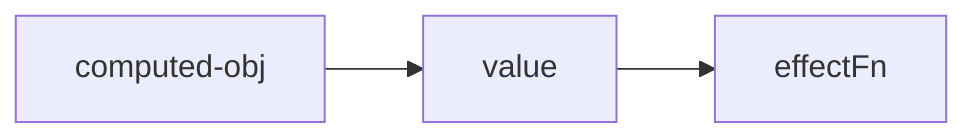

## watch

```js

function watch(source, cb) {
  let getter;

  // 定义旧值与新值
  let oldVal, newVal;

  // 如果source是函数，说明用户传递的是getter，所以直接把source赋值给getter
  if (typeof source === 'function') {
    getter = source
  } else {
    getter = () => traverse(source)
  }
  // 使用effect注册副作用函数时，开启lazy选项，并把返回值存储到effectFn中以便后续调用
  const effectHandler = effect(
    () => getter(),
    {
      scheduler() {
        // 在scheduler 中重新执行副作用函数，得到的是新值
        newVal = effectHandler()
        // 将旧值和新值作为回调函数的参数
        cb(newVal, oldVal)
        // 更新旧值，不然下一次会得到错误的值
        oldVal = newVal
      },
      lazy: true
    }
  )
  // 手动调用副作用函数，拿到的就是旧值
  oldVal = effectHandler()
}

function traverse(value, seen = new Set()) {
  // 如果要读取的数据是原始值，或者已经被读取过了，那么什么都不做
  if (typeof value !== 'object' || value === null || seen.has(value)) return

  // 将数据添加到seen中，代表遍历地读取过了，避免循环引用引起的死循环
  seen.add(value)
  // 暂时不考路数组等其他结构

  // 假设value 就是个对象，使用for...in读取对象的每一个值，并递归的调用traverse进行处理

  for (const k in value) {
    traverse(value[k], seen)
  }

  return value
}


```

## 立即执行的watch与回调执行时间

```js

function watch(source, cb, options) {
  let getter;

  // 定义旧值与新值
  let oldVal, newVal;

  // 如果source是函数，说明用户传递的是getter，所以直接把source赋值给getter
  if (typeof source === 'function') {
    getter = source
  } else {
    getter = () => traverse(source)
  }
  // 使用effect注册副作用函数时，开启lazy选项，并把返回值存储到effectFn中以便后续调用

  // 提取 scheduler 调度函数为一个独立的 job 函数
  const job = () => {
    // 在scheduler 中重新执行副作用函数，得到的是新值
    newVal = effectHandler()
    // 将旧值和新值作为回调函数的参数
    cb(newVal, oldVal)
    // 更新旧值，不然下一次会得到错误的值
    oldVal = newVal
  }
  const effectHandler = effect(
    () => getter(),
    {
      scheduler() {
        if (options.flush === 'post') {
          const p = Promise.resolve()
          p.then(job)
        } else {
          job()
        }
        
      },
      lazy: true
    }
  )
  if (options.immediate) {
    job()
  } else {
    // 手动调用副作用函数，拿到的就是旧值
    oldVal = effectHandler()
  }
  
}

```
## 过期的副作用

竟态问题通常在多线程或者多进程编程中被提及，但是在单线程的JavaScript中也存在竟态问题，比如下面的代码：

```js
let finalData;

watch(obj, async () => {
  // 发送请求
  const res = await fetch('/path/to/request')
  // 存储数据
  finalData = res
})
```

观察上面的代码。乍一看似乎没什么问题。但仔细思考会发现这段代码会发生竞态问题。假设我们第一次修改了obj对象的某个字段，这会导致回调函数执行，同时发送了第一次请求A，随着时间的推移，在请求A的结果返回之前，我们对obj对象的某个字段值进行了二次修改。这会导致发送第二次请求B。此时请求A和请求B都在进行中，那么哪一个请求会先返回结果呢？我们不确定，如果请求B先于请求A返回结果，就会导致finalData中存储的是A请求的结果。

但由于请求B是后发送的，因此我们认为请求B返回的数据才是**最新的**，而请求A则应该被视为"过期"的，所以我们希望变量finalData存储的值应该是由请求B返回的结果，而非请求A返回的结果。

归根结底，我们需要的是一个让副作用过期的手段。我们先拿Vuejs中的watch函数来复现场景。

在Vuejs中，watch函数的回调函数接受第三个参数onInvalidate，它是一个函数，类似于事件监听器，我们可以使用onInvalidate函数注册一个回调，这个回调函数会在当前副作用函数过期时执行：

```js
function watch(source, cb, options) {
  let getter;

  
  // 如果source是函数，说明用户传递的是getter，所以直接把source赋值给getter
  if (typeof source === 'function') {
    getter = source
  } else {
    getter = () => traverse(source)
  }
  // 使用effect注册副作用函数时，开启lazy选项，并把返回值存储到effectFn中以便后续调用

  // 定义旧值与新值
  let oldVal, newVal;

  // cleanup 用来存储用户注册的过期回调
  let cleanup

  function onInvalidate(fn) {
    // 将过期回调存储到cleanup中
    cleanup = fn
  }

  // 提取 scheduler 调度函数为一个独立的 job 函数
  const job = () => {
    // 在scheduler 中重新执行副作用函数，得到的是新值
    newVal = effectHandler()

    // 在调用回调函数之前，先调用过期回调
    cleanup && cleanup()
    // 将旧值和新值作为回调函数的参数
    cb(newVal, oldVal, onInvalidate)
    // 更新旧值，不然下一次会得到错误的值
    oldVal = newVal
  }
  const effectHandler = effect(
    () => getter(),
    {
      scheduler() {
        if (options.flush === 'post') {
          const p = Promise.resolve()
          p.then(job)
        } else {
          job()
        }
      },
      lazy: true
    }
  )
  if (options.immediate) {
    job()
  } else {
    // 手动调用副作用函数，拿到的就是旧值
    oldVal = effectHandler()
  }
  
}

```

在这段代码中，我们首先定义了cleanup变量，这个变量用来存储用户通过onInvalidate函数注册的过期回调。这里的关键点在job函数内，每次执行回调函数cb之前，先检查是否存在过期回调，如果存在，则执行过期回调函数cleanup。

我们通过一个例子来说明：

```js
watch(data, async (newVal, oldVal, onInvalidate) => {
  let expired = false

  onInvalidate(() => {
    expired = true
  })

  const res = await fetch('/path/xxx/xxx')

  if (!expired) {
    result = res
  }
  
}) 
// 第一次修改
data.text1++

setTimeout(() => {
  // 200ms 后做第二次修改
  data.text1++
}, 200)
```

如以上代码所示，我们修改了两次data.text1的值。由于在watch回调函数第一次执行的时候，我们已经注册了一个过期回调，所以在watch的回调函数第二次执行之前，会优先执行之前注册的过期回调，这会使得第一次执行的副作用函数内闭包的变量expired的值变为true，即副作用函数的执行过期了。于是等请求A的结果返回时，其结果会被抛弃，从而避免了过期副作用函数带来的影响。如图所示

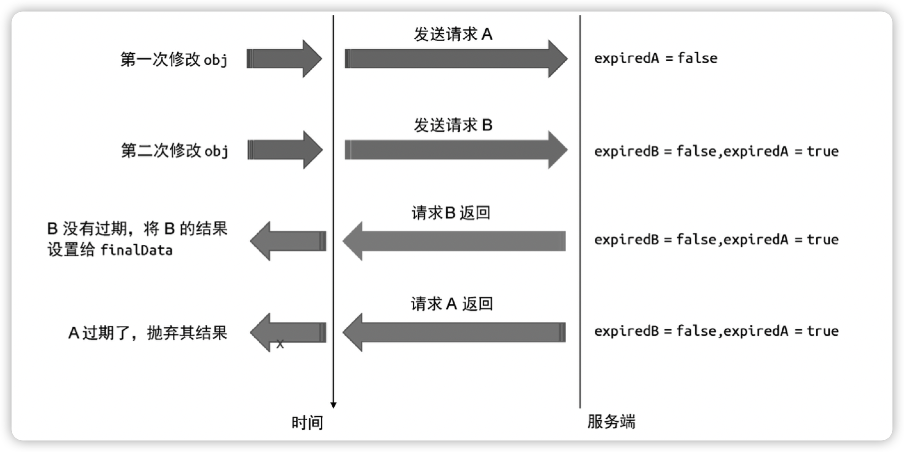

# 总结

一个响应式数据最基本的实现依赖于对“读取”和“设置”操作的拦截，从而在副作用函数与响应式数据之前建立联系。在“读取”操作发生时，我们将当前执行的副作用函数存储到“桶”中；当“设置”操作发生时，再将副作用函数从“桶”里取出来并执行。这就是响应系统的根本实现原理。

接着，我们实现了一个相对完善的响应系统。使用WeakMap配合了Map建立了新的“桶”结构，从而能够在响应式数据与副作用函数之间建立更加精确的联系。

1. 修改桶结构
2. 分支切换的冗余副作用问题，这个问题会导致副作用函数进行不必要的更新。为了解决这个问题，威们需要在每次副作用函数重新执行之前，清楚上一次建立的响应联系，而当副作用函数重新执行后，会再次建立新的响应联系，新的响应联系中不存在冗余副作用问题。
3. 我们还遇到了遍历Set数据结构导致无限循环的问题，该问题产生的原因可以从ECMA规范中得知，即“调用forEach遍历Set集合时，如果一个值已经被访问过了，但这个值被删除并重新添加到集合，如果此时forEach遍历没有结束，那么这个值会重新被访问”。解决方案时建立一个新的Set数据结构用来便利。
4. 副作用的嵌套问题。在实际场景中，嵌套的副作用函数发生在组件嵌套的场景中，即父子组件关系。这时为了避免响应式数据与副作用函数之间建立的响应式联系发生错乱，我们需要使用副作用函数栈来存储不同的副作用函数。当一个副作用函数执行完毕后，将其从栈中弹出。当读取响应式数据的时候，被读取的响应式数据只会与当前站定的副作用函数建立响应联系。而后，我们遇到了副作用函数无限递归地调用自身，导致栈溢出的问题。该问题的根本原因在于，对响应式数据的读取和设置发生在同一个副作用函数内。解决办法很简单，如果trigger触发执行的副作用与当前正在执行的副作用函数相同，则不触发执行
5. 随后，我们讨论了响应系统的可调度性。所谓可调度，指的是当trigger动作触发副作用函数重新执行时，有能力决定副作用函数执行的时机、次数以及方式。我们通过scheduler选项指定调度器，这样用户可以通过调度器自行完成任务的调度。
6. 通过微任务队列对调度器任务进行去重
7. 计算属性，即通过lazy选项使得副作用函数可以懒执行。利用这个特点，我们设计了计算属性，当读取计算属性的值时，只需要手动执行副作用函数即可。
8. watch。它本质上利用了副作用函数的可调度性。
9. 最后，我们讨论了过期的副作用函数，它会导致竟态问题
