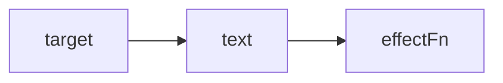
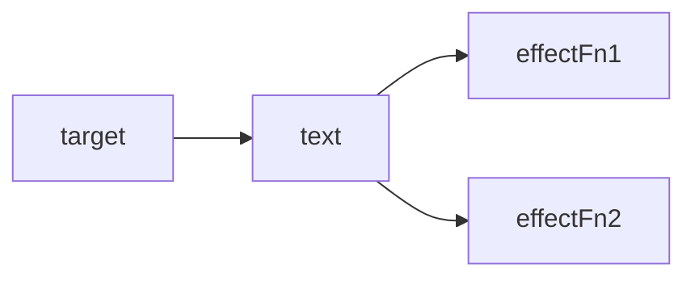
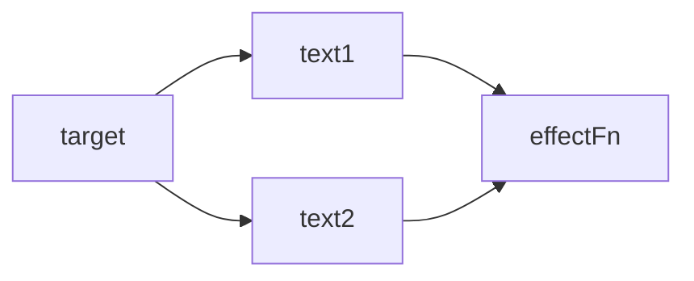
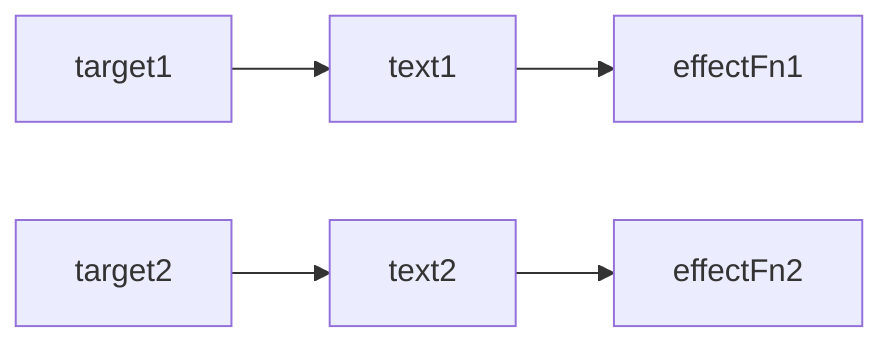
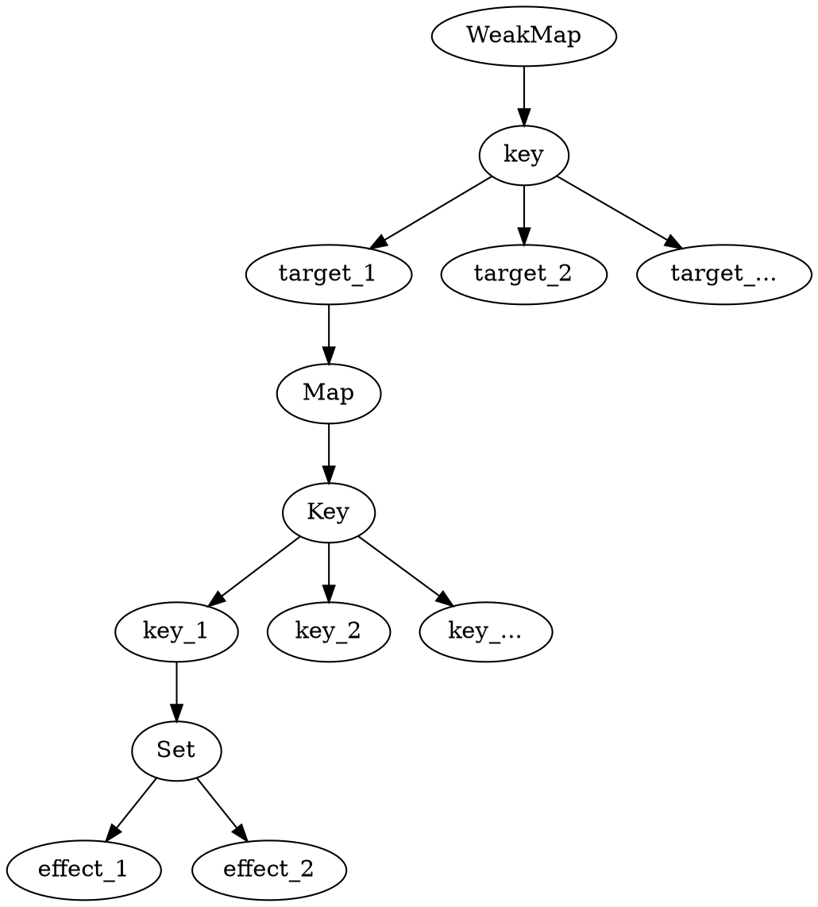

# 前置知识

## 副作用函数

副作用函数指的是会产生副作用的函数，如下面的代码

```ts
function effect() {
  document.body.innerText = 'hello vue3'
}
```

effect函数的执行会直接或者间接影响其他函数的执行，这时我们说effect函数产生了副作用。

副作用很容易产生，例如一个函数修改了全局变量

```ts
// 全局变量
let val = 1
function effect() {
  val = 2 // 修改全局变量，产生副作用
}

``` 

## 响应式数据

理解了什么是副作用函数，再来说说什么是响应式数据

```ts
const obj = { text: 'hello world' }
function effect() {
  document.body.innerText = obj.text
}
```

如上面的代码，副作用函数effect会设置body元素的innerText属性。当**obj.text**的值发生改变时，我们希望effect会重新执行

如果我们能做到这一点，那么对象obj就是响应式数据

# 基本实现

接着上文思考，如何才能让obj变成响应式数据呢？

1. 当effect执行时，会触发字段**obj.text**的读取操作
2. 当修改obj.text的值时，会触发字段**obj.text**的设置操作

如果我们能拦截到一个对象的读取和设置操作，那么事情就变得简单了，当读取字段obj.text时，我们可以把副作用函数effect存到一个桶里


接着，当设置obj.text时，再把副作用函数effect从"桶里"拿出来并执行即可

现在我们的问题变成了如何拦截对象属性的读取和设置操作，有两种方式

1. Object.defineProperty：(Vue2采用的方式)
2. Proxy：(Vue3采用的方式)

``` ts
// 存储副作用函数的桶
const bucket = new Set()

// 原始数据
const data = { text: 'hello world' }
// 对原始数据的代理
const obj = new Proxy(data, {
  // 拦截读取操作
  get(target, key) {
    bucket.add(effect)

    return target[key]
  },

  // 拦截设置操作
  set(target, key, value) {
    target[key] = value
    
    // 取出effect执行
    bucket.forEach(fn => fn())
    
    return true
  }
})
```

> 提问：上面的这段代码有什么缺陷？

**我们直接通过名字effect来获取副作用函数，要是换了个名字怎么办**

因此我们要想办法去掉这种硬编码的机制

# 完善的响应式系统

先来解决上面遗留下来的问题

```ts
// 用一个全局变量存储被注册的副作用函数
let activeEffect

// 用于注册副作用函数
function effect(fn) {
  // 当调用的时候赋值给activeEffect
  activeEffect = fn

  fn()
}


// 存储副作用函数的桶
const bucket = new Set()

// 原始数据
const data = { text: 'hello world' }
// 对原始数据的代理
const obj = new Proxy(data, {
  // 拦截读取操作
  get(target, key) {
    if (activeEffect) // 新增
      bucket.add(activeEffect) // 新增

    return target[key]
  },

  // 拦截设置操作
  set(target, key, value) {
    target[key] = value

    // 取出effect执行
    bucket.forEach(fn => fn())
    
    return true
  }
})

effect(
  () => {
    console.log('effect run')
    document.body.innerText = obj.text
  }
)
```

可以看到，匿名副作用函数内部读取了字段obj.text的值，于是乎与副作用函数会建立起响应联系。

接着，我们开启了一个定时器，为对象添加了一个**新属性**,我们知道，在匿名副作用函数内并没有读取obj.notExist属性的值，所以理论上，字段obj.notExist并没有与副作用建议响应联系，因此，定时器内语句的执行不应该触发匿名函数的重新执行。

提问：导致该问题的根本原因是什么？

我们来解决这个问题，需要重新设计"桶的数据结构"

在上一节中，我们使用了Set(集合)数据结构来当副作用函数的"桶"。例如当读取属性时，无论是哪一个属性，都会收集到桶里；当设置属性时，无论是哪一个属性，也都会从“桶”里把副作用函数拿出来执行。

**导致该问题的根本原因是，我们没有在副作用函数与被操作的目标字段之间建立明确的联系**。

那应该怎么设计呢？在回答这个问题前，我们需要先仔细观察下面的代码：

```ts
effect(function effectFn() {
  document.body.innerText = obj.text
})
```

这段代码存在三个角色：

1. 被(读取)的代理对象obj
2. 被(读取)的字段名text
3. 使用effect函数注册的副作用函数effectFn

如果用target来表示一个代理对象所代理的原始对象，用key来表示被操作的字段名，用effectFn来表示被注册的副作用函数，那么可以把这三种建立如下关系：


这是一种树形结构，下面继续举几个例子进行补充说明

如果有两个副作用函数同事读取同一个对象的属性值

```ts
effect(function effectFn1() {
  obj.text
})
effect(function effectFn2() {
  obj.text
})
```
那么关系如下


如果一个副作用函数读取了同一个对象的两个不同属性

```ts
effect(function effectFn() {
  obj.text1
  obj.text2
})

```



如果在不同的副作用函数读取了两个对象的不同属性：


```ts
effect(function effectFn1() {
  obj1.text1
})
effect(function effectFn2() {
  obj2.text2
})
```

那么关系如下：



接着，我们尝试用代码来实现这个新的"桶"。首先，我们需要用**WeakMap**代替Set作用桶的数据结构:

```ts
const bucket = new WeakMap()

const obj = new Proxy(data, {
  get(target, key) {
    if (!activeEffect) return

    // 根据target从"桶"中取得depsMap, 它也是一个Map类型：key --> effect
    let depsMap = bucket.get(target)
    // 如果不存在depsMap，那么新建一个Map并与其关联
    if (!depsMap) bucket.set(target, depsMap = new Map())

    // 在根据key从depsMap中取得deps，它是一个Set类型
    // 里面存储着所有与当前key相关联的副作用函数，effects
    let deps = depsMap.get(key)
    if (!deps) depsMap.set(key, deps = new Set())
    
    // 最后将当前激活的副作用函数添加到"桶里"
    deps.add(activeEffect)

    return target[key]
  },
  set(target, key, newValue) {
    target[key] = newValue

    // 根据target从桶中取得depsMap,它是key --> effect
    const depsMap = bucket.get(target)
    if (!depsMap) return
    // 根据key取得所有副作用函数 effects
    const effects = depsMap.get(key)

    // 执行副作用函数
    effects && effects.forEach(fn => fn())
  }
})
```


从这段代码可以看出构建数据结构的方式，我们分别使用了WeakMap、Map和Set

1. WeakMap由target --> Map 构成
2. Map 由 key --> Set 构成

来看一下关系图：



