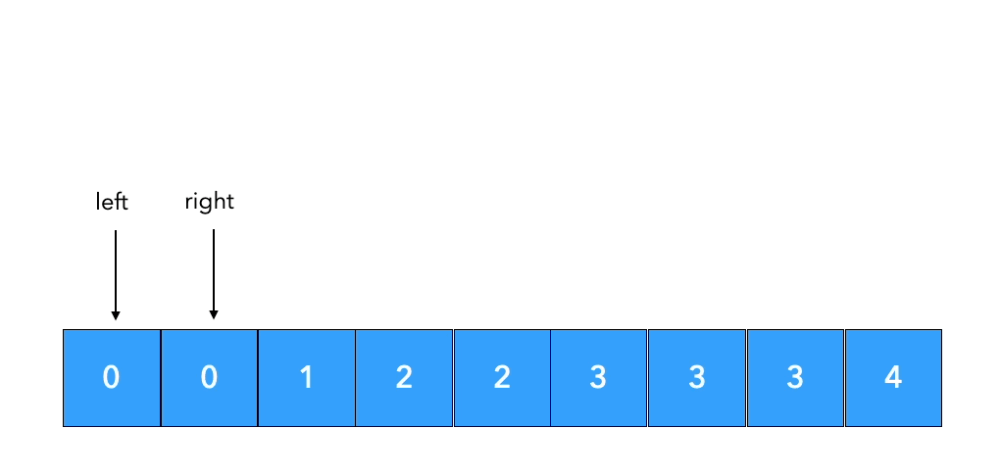
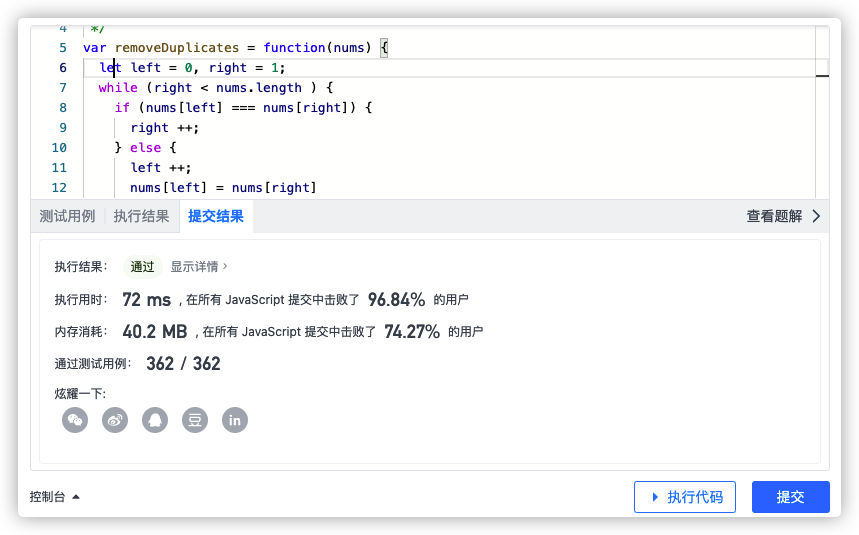
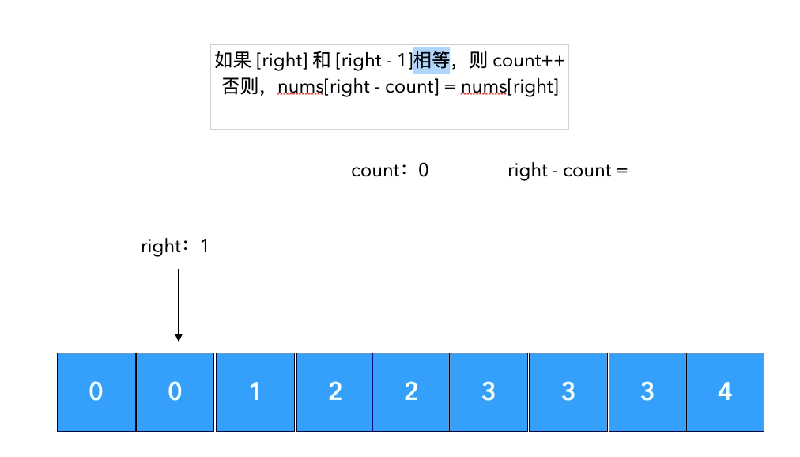

给你一个有序数组 nums ，请你 原地 删除重复出现的元素，使每个元素 只出现一次 ，返回删除后数组的新长度。

不要使用额外的数组空间，你必须在 原地 修改输入数组 并在使用 O(1) 额外空间的条件下完成。

 

说明:

为什么返回数值是整数，但输出的答案是数组呢?

请注意，输入数组是以「引用」方式传递的，这意味着在函数里修改输入数组对于调用者是可见的。

你可以想象内部操作如下:

```js
// nums 是以“引用”方式传递的。也就是说，不对实参做任何拷贝
int len = removeDuplicates(nums);

// 在函数里修改输入数组对于调用者是可见的。
// 根据你的函数返回的长度, 它会打印出数组中 该长度范围内 的所有元素。
for (int i = 0; i < len; i++) {
    print(nums[i]);
}
 
```
示例 1：
```js
输入：nums = [1,1,2]
输出：2, nums = [1,2]
解释：函数应该返回新的长度 2 ，并且原数组 nums 的前两个元素被修改为 1, 2 。不需要考虑数组中超出新长度后面的元素。
```
示例 2：

```js

输入：nums = [0,0,1,1,1,2,2,3,3,4]
输出：5, nums = [0,1,2,3,4]
解释：函数应该返回新的长度 5 ， 并且原数组 nums 的前五个元素被修改为 0, 1, 2, 3, 4 。不需要考虑数组中超出新长度后面的元素。
```
 

提示：

```js

0 <= nums.length <= 3 * 104
-104 <= nums[i] <= 104
nums 已按升序排列
```


```js
var removeDuplicates = function(nums) {
    
};

```

# 解法

## 我的笨比解法

```js
var removeDuplicates = function(nums) {
    for(let i = 0; i < nums.length; i ++) {
        if (nums[i + 1] !== undefined && nums[i + 1] === nums[i]) {
            nums.splice(i--, 1)
        }
    }
    return nums.length
};
```

虽然可以通过，但是效率很低，需要循环双倍次数

## 双指针法

使用两个指针，**右指针始终往右移动**，

- 如果右指针指向的值等于左指针指向的值，左指针不动。
- 如果右指针指向的值不等于左指针指向的值，那么左指针往右移一步，然后再把右指针指向的值赋给左指针。

最终返回left + 1 即是长度



### 代码之好理解版本

```js

var removeDuplicates = function(nums) {
  let left = 0, right = 1;
  // 循环跳出的条件是right 走到尾部了
  while (right < nums.length ) {
    if (nums[left] === nums[right]) {
      // 如果两个相等了，right右移动
      right ++;
    } else {
      // 两个不相等，left先右移，然后把right赋值过来，接着right在右移动，然后让循环继续走
      left ++;
      nums[left] = nums[right]
      right ++
    }
  }
  return ++left
};

```



### 代码之完美版本

```js
var removeDuplicates = function(nums) {
  if (!nums || nums.length === 0) return 0
  let left = 0, right = 1;
  for (; right < nums.length; right ++ ) {
    if (nums[left] !== nums[right]) {
      nums[++left] = nums[right]
    }
  }
  return ++left
};
```

## 计数法

这种非常的绕，比上面那两种难理解的多。先看代码

```js
var removeDuplicates = function(nums) {
  let count = 0;  // 重复的数字个数
  for (let right = 1; right < nums.length; right ++) {
    if (nums[right] === nums[right - 1]) {
      // 如果有重复的，count要加1
      count ++;
   } else {
     // 如果没有重复，后面的就往前挪
     nums[right - count] = nums[right]
   }
  }

  return nums.length - count
};
```

流程如下



