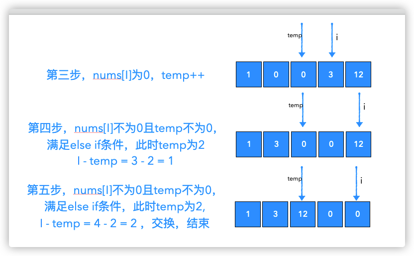

给定一个数组 nums，编写一个函数将所有 0 移动到数组的末尾，同时保持非零元素的相对顺序。

示例:
```
输入: [0,1,0,3,12]
输出: [1,3,12,0,0]
```
说明:

必须在原数组上操作，不能拷贝额外的数组。
尽量减少操作次数。

# 交换法


```js
/**
 * @param {number[]} nums
 * @return {number[]} Do not return anything, modify nums in-place instead.
 */
var moveZeroes = function(nums) {
    let flag = 0
    for (let i = 0; i < nums.length; i ++) {
        if (nums[i] !== 0) {
            nums[flag++] = nums[i]
        }
    }
    while(flag < nums.length) {
        nums[flag++] = 0
    }
    return nums
};
```

# 统计个数且交换法




```js
/**
 * @param {number[]} nums
 * @return {number[]} Do not return anything, modify nums in-place instead.
 */
var moveZeroes = function(nums) {
    let temp = 0 // 统计0的个数
    for (let i = 0; i < nums.length; i++) {
        if (nums[i] === 0) {
            temp ++
        } else if (temp !== 0) {
            //否则，把当前数字放到最前面那个0的位置，然后再把
            //当前位置设为0
            nums[i - temp] = nums[i]
            nums[i] = 0
        }
    }
    
    return nums
};
```